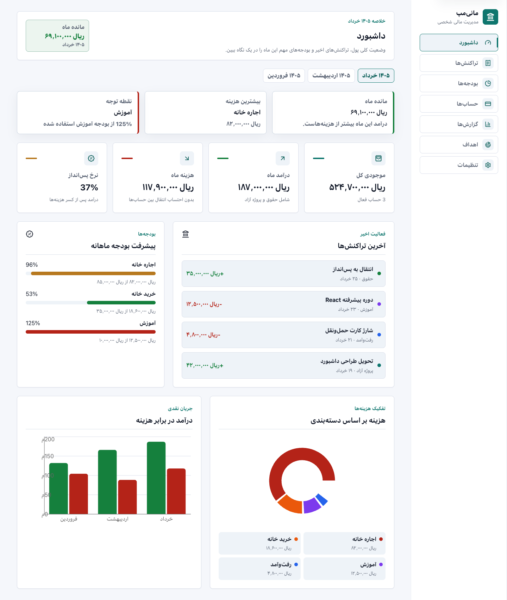
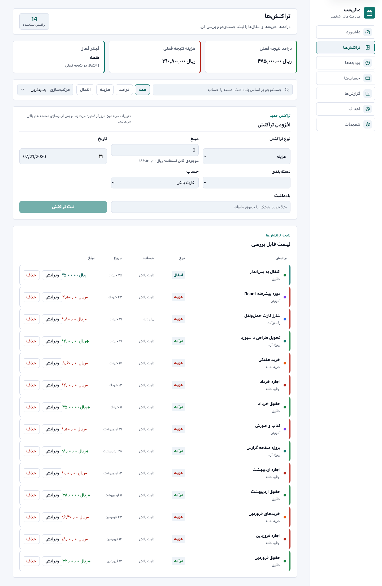
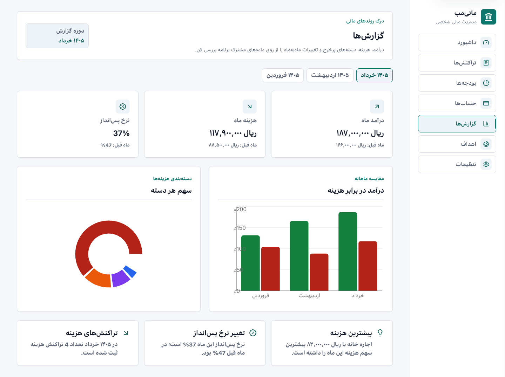
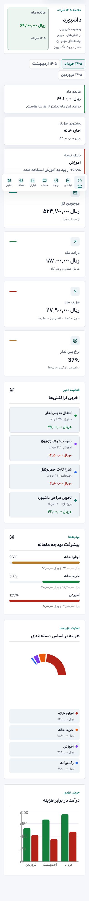

# MoneyMap

MoneyMap is a responsive personal finance dashboard built with React,
TypeScript, and Vite. It helps users track accounts, transactions, budgets,
savings goals, and monthly reports from one clean interface.

The app is designed as a portfolio-ready frontend project with Persian RTL as
the primary experience, English/LTR support in the app shell, persisted browser
state, validation-heavy forms, charts, and tests.

## Links

- Live demo: [elahe-fakour.github.io/money-map](https://elahe-fakour.github.io/money-map/)
- Source code: [github.com/elahe-fakour/money-map](https://github.com/elahe-fakour/money-map)

## Highlights

- Persian-first RTL interface with app-level language and direction settings
- Responsive layout with desktop sidebar and mobile bottom navigation
- Dashboard with monthly summaries, charts, recent activity, budget preview,
  empty states, and month switching
- Transactions page with search, filters, sorting, add, edit, delete, balance
  validation, and persisted state updates
- Accounts page with account creation, transfer flow, and transfer validation
- Budgets page with live spending calculations from transaction data
- Savings goals with target progress and contribution validation
- Reports page with month switching, cash-flow chart, category breakdown, and
  monthly insights
- Settings page with language, direction, currency, theme mode, reset,
  JSON backup, and restore
- Local persistence with `localStorage`
- Unit and integration tests with Vitest and React Testing Library

## Screenshots

### Dashboard



### Transactions



### Reports



### Mobile Dashboard



## Tech Stack

- React 19
- TypeScript
- Vite
- React Router
- Context + `useReducer`
- React Hook Form + Zod
- Recharts
- Lucide React
- Vitest + React Testing Library
- Playwright foundation
- Storybook foundation

## What This Project Demonstrates

MoneyMap is intentionally built beyond a static UI. It demonstrates:

- Domain modeling with reusable finance types
- Shared state management without overcomplicating the stack
- Derived financial calculations for balances, budgets, and reports
- Form validation and user-friendly error messages
- Routing and route-level lazy loading
- Locale-aware Persian UI foundations
- Responsive dashboard and data-heavy page layouts
- Safe import/export of browser-stored data
- Test coverage for important calculation and provider behavior

## Recent UI/UX Polish

- Clearer Persian microcopy for financial actions, empty states, and validation
- Confirmation before replacing locally stored finance data
- Keyboard skip link, visible focus states, and reduced-motion support
- Responsive sidebar and mobile navigation with RTL-aware spacing

## App Sections

| Section | What it does |
| --- | --- |
| Dashboard | Monthly summary, account balance, income, expenses, savings rate, charts |
| Transactions | Search, filter, sort, add, edit, delete, and validate transactions |
| Accounts | Manage accounts and transfer money between balances |
| Budgets | Compare planned monthly budgets with actual spending |
| Goals | Track savings goals and add validated contributions |
| Reports | Review monthly income, expenses, category breakdown, and insights |
| Settings | Configure language, direction, currency, theme, backup, and restore |

## Getting Started

Install dependencies:

```bash
npm install
```

Start the development server:

```bash
npm run dev
```

Open the local URL printed by Vite.

## Available Scripts

```bash
npm run dev
npm run build
npm run lint
npm test
npm run test:watch
npm run test:e2e
npm run storybook
npm run storybook:build
npm run preview
```

## Verification

Run the main checks:

```bash
npm run lint
npm test
npm run build
```

End-to-end tests use the Chrome browser installed on your system:

```bash
npm run test:e2e
```

If Chrome is not installed, install it first or configure Playwright with its
bundled Chromium browser.

To use Playwright's bundled Chromium instead:

```bash
npx playwright install chromium
```

## Project Structure

```text
src/
  app/          App-level context, provider, routing, lazy pages
  data/         Mock finance data
  features/     Feature pages such as dashboard, transactions, budgets
  hooks/        Shared React hooks
  services/     Mock data service layer
  types/        Finance domain TypeScript models
  utils/        Formatters and finance calculation helpers
```

## Data And Persistence

MoneyMap starts from realistic mock finance data. User changes are stored in
browser `localStorage`, so transactions, settings, backups, goals, and account
changes remain after refresh.

The settings page also supports:

- Resetting the app to sample data
- Exporting the current finance state as JSON
- Importing a validated MoneyMap backup JSON file

## Deployment

MoneyMap is a Vite static frontend and can be deployed to GitHub Pages, Vercel,
Netlify, or any static host.

Recommended deployment settings:

- Build command: `npm run build`
- Output directory: `dist`
- Node version: active LTS, such as Node 22 or Node 24

This repository also includes:

- `.github/workflows/deploy-github-pages.yml` for automatic GitHub Pages deploys
- `vercel.json` for React Router fallback routes on Vercel
- `netlify.toml` for Netlify build and SPA redirects

GitHub Pages deployment:

1. Open the repository settings on GitHub.
2. Go to **Pages**.
3. Set **Source** to **GitHub Actions**.
4. Push to `main`.
5. Open the deployed URL from the completed **Deploy GitHub Pages** workflow.

## Roadmap

See:

- `PROJECT_PLAN.md` for the product plan
- `MONEY_MAP_TASKS.md` for the step-by-step development roadmap

## License

MIT

## Status

MoneyMap is live on GitHub Pages and ready to showcase as a portfolio project.
